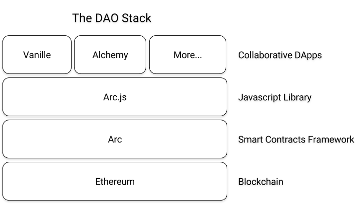

# DAOstack Docs

Welcome to DAOstack Docs!

This is the place for general DAOstack documentation (i.e. not specific to any DAOstack project).
It includes important documents such as:
- [The official DAOstack whitepaper](https://github.com/daostack/docs/blob/master/DAOstack%20White%20Paper%20V1.0.pdf).
- Roadmap (Coming soon ...).
- Vision (Coming soon ...).

## Overview

DAOstack is an operating system and an ecosystem for building DAOs on the [Ethereum](https://www.ethereum.org/) blockchain.
It comprises of a few sub-projects:

1. [Arc](https://github.com/daostack/arc) - The lowest layer of the stack that consists of a set of smart contracts that define the main components and abstractions used to build any DAO on DAOstack.
2. [Arc.js](https://github.com/daostack/arc.js) - A JavaScript library built on top of web3.js that handles the interaction with and deployment of `Arc`
2. [Vanille](https://github.com/daostack/vanille) - A web frontend built on `Arc.js` that provides a GUI to create, build and interact with DAOs in an easy way.
3. [Alchemy](https://github.com/daostack/alchemy) - A DApp that uses DAOstack to manage funds and demonstrates a real world use case for DAOstack.

Join us on [Telegram](https://t.me/daostackcommunity) and [Slack](https://daostack.slack.com)!
